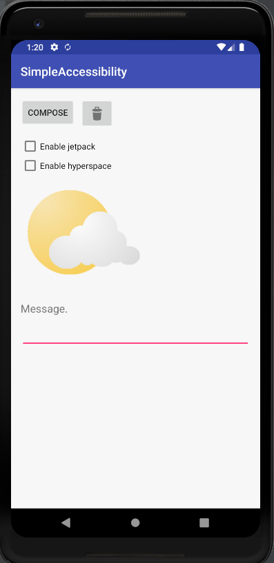
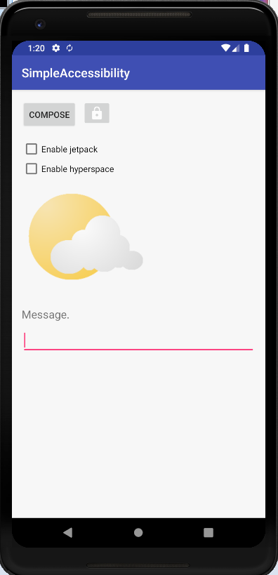

SimpleAccessibility (Starter Code) 
==================================

The SimpleAccessibility app demonstrates how to add accessible features 
to your app's user interface.

This is the starter code used in the lesson (SimpleAccessibility-Starter). See the 
SimpleAccessiblity directory for the solution code.

Pre-requisites
--------------

For this app you should be familiar with: 
* Creating, building, and running apps in Android Studio.
* Creating views and layouts in both Android Studio's design editor and XML.

Getting Started
---------------

1. Download and open this sample in Android Studio.

License
-------

Copyright 2017 Google, Inc.

Licensed to the Apache Software Foundation (ASF) under one or more contributor
license agreements.  See the NOTICE file distributed with this work for
additional information regarding copyright ownership.  The ASF licenses this
file to you under the Apache License, Version 2.0 (the "License"); you may not
use this file except in compliance with the License.  You may obtain a copy of
the License at

  http://www.apache.org/licenses/LICENSE-2.0

Unless required by applicable law or agreed to in writing, software
distributed under the License is distributed on an "AS IS" BASIS, WITHOUT
WARRANTIES OR CONDITIONS OF ANY KIND, either express or implied.  See the
License for the specific language governing permissions and limitations under
the License.

Overview file is attached as a word file: CreateAccessibleAppsOverview.docx

Instructions:

- Run the Android project.
- Create a new Virtual Device if not already. Then, choose Pixel 2 XL, then click OK.
- It will load the app.

